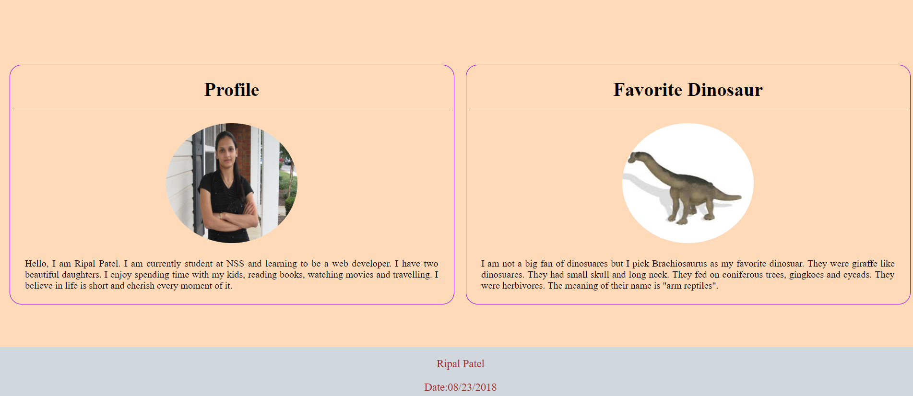

# Favorite Dino
This project is an exploration of HTML and CSS. I created website for favorite dinosaur. There are two cards on the website. One card has details about me and the other card has information about my favorite dionosaur.


## Screenshots


## How to run this project
* Use npm to install http-server in your terminal:
```
npm install -g http-server
```
* Run the server
```
hs -p 9999
```
* Open chrome and navigate to :
```
localhost:9999
```
